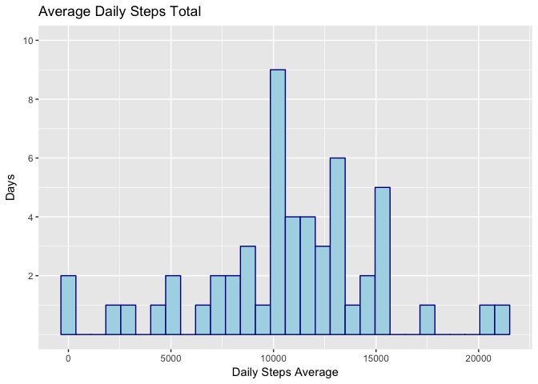
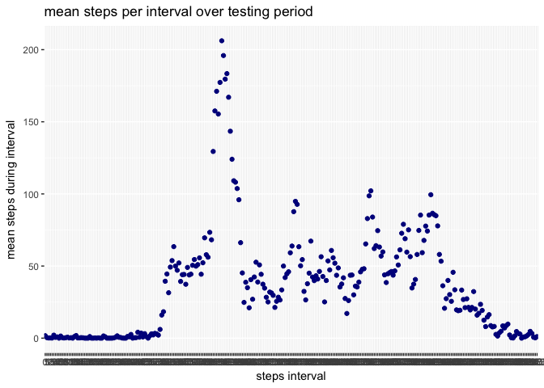
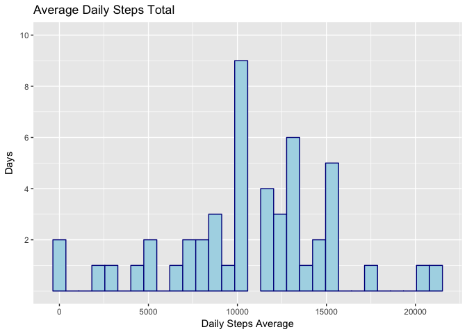
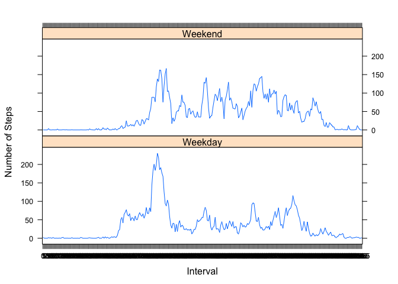

## Loading and preprocessing the data

Create data folder in working directory if it does not exist, then access and download the data into this folder

```r
if(!file.exists("data")){dir.create("data")}
zipurl <- "https://d396qusza40orc.cloudfront.net/repdata%2Fdata%2Factivity.zip"
destzip <- "./data/activitydata.zip"
destfile <- "./data/activitydata"
download.file(url=zipurl, destfile=destzip, method='curl')
unzip(destzip,exdir=destfile)
```


Load R libraries for use

```r
library(dplyr)
```

```
## Warning: package 'dplyr' was built under R version 3.4.2
```

```
## 
## Attaching package: 'dplyr'
```

```
## The following objects are masked from 'package:stats':
## 
##     filter, lag
```

```
## The following objects are masked from 'package:base':
## 
##     intersect, setdiff, setequal, union
```

```r
library(ggplot2)
library(lattice)
```

Load the data from the local data file into a data frame to use, and convert to tibble

```r
fname <- "./data/activitydata/activity.csv"
activity <- read.csv(fname)
activity <- tbl_df(activity)
```

## What is mean total number of steps taken per day?
1. Calculate the total number of steps taken per day

```r
aday <- activity %>% filter(!is.na(steps)) %>% group_by(date) %>% summarize(m = 288*mean(steps))
```

2. Make a histogram of the total number of steps taken each day

```r
ggplot(aday, aes(m)) + geom_histogram(color="darkblue", fill="lightblue") + 
      labs(title="Average Daily Steps Total", x="Daily Steps Average", y="Days") +
      scale_y_continuous(breaks=c(2,4,6,8,10), limits = c(0,10)) 
```

```
## `stat_bin()` using `bins = 30`. Pick better value with `binwidth`.
```

<!-- -->

3. Calculate and report the mean and median of the total number of steps taken per day

```r
totalmean <- mean(aday$m)
totalmed <- median(aday$m)
```
  
  The mean number of steps for all dates: 1.0766189\times 10^{4}  
  The median number of steps for all dates: 1.0765\times 10^{4}

## What is the average daily activity pattern?
1. Make a time series plot (i.e. 𝚝𝚢𝚙𝚎 = "𝚕") of the 5-minute interval (x-axis) and the average number of steps taken, averaged across all days (y-axis)

```r
atype <- activity %>% filter(!is.na(steps)) %>% group_by(interval) %>% summarize(m = mean(steps))
#insure interval is treated as a factor
atype$interval <- as.factor(atype$interval)
ggplot(atype, aes(x=interval, y=m)) + geom_point(color="darkblue") + labs(x = "steps interval", y = "mean steps during interval", title = "mean steps per interval over testing period")
```

<!-- -->

2. Which 5-minute interval, on average across all the days in the dataset, contains the maximum number of steps?

```r
amax <- atype[which.max(atype$m),]
maxinterval <- amax$interval
```

On average, **interval 835** has the maximum number of steps

## Imputing missing values
Note that there are a number of days/intervals where there are missing values (coded as 𝙽𝙰). The presence of missing days may introduce bias into some calculations or summaries of the data.

1. Calculate and report the total number of missing values in the dataset

```r
totalna <- sum(is.na(activity$steps))
```
A: There are 2304 records with missing steps values

2. Devise a strategy to imput the missing values in the dataset

A: Missing step values are imputed by using the mean for that time interval 
Steps:
1. Merge data with the calculated interval mean dataset
2. Create a new column to track imputed values and initiate it equal to the steps column
3. Replace the na values in the new column with the values from the column for the interval mean


3. Create a new dataset that is equal to the original dataset but with the missing data filled in.

```r
am <- merge(activity,atype, by="interval") %>% tbl_df
am$impsteps <- am$steps
am$impsteps[ is.na(am$impsteps) ] <- am$m[ is.na(am$impsteps) ]
ams <- am %>% select(impsteps,date,interval) 
```


4. Make a histogram of the total number of steps taken each day and Calculate and report the mean and median total number of steps taken per day. 

```r
amday <- ams %>%  group_by(date) %>% summarize(m = 288*mean(impsteps))
ggplot(amday, aes(m)) + geom_histogram(color="darkblue", fill="lightblue") + 
      labs(title="Average Daily Steps Total", x="Daily Steps Average", y="Days") +
      scale_y_continuous(breaks=c(2,4,6,8,10), limits = c(0,10)) 
```

```
## `stat_bin()` using `bins = 30`. Pick better value with `binwidth`.
```

```
## Warning: Removed 1 rows containing missing values (geom_bar).
```

<!-- -->

```r
impmean <- mean(amday$m)
impmed <- median(amday$m)
```
Do these values differ from the estimates from the first part of the assignment? 

**Data [Original vs. Imputed]**  
Mean: 10766.19 vs 10766.19  
Median: 10765 vs. 10766.19  

What is the impact of imputing missing data on the estimates of the total daily number of steps?
It sets the median equal to the mean


## Are there differences in activity patterns between weekdays and weekends?
For this part the 𝚠𝚎𝚎𝚔𝚍𝚊𝚢𝚜() function may be of some help here. Use the dataset with the filled-in missing values for this part.

1. Create a new factor variable in the dataset with two levels – “weekday” and “weekend” indicating whether a given date is a weekday or weekend day.

```r
ams$weekday <- weekdays(as.Date(ams$date))
```

```
## Warning in strptime(xx, f <- "%Y-%m-%d", tz = "GMT"): unknown timezone
## 'default/America/Chicago'
```

```r
ams$weekend <- "Weekday"
ams$weekend[ams$weekday == "Saturday" | ams$weekday == "Sunday"] <- "Weekend"
ams$weekend <- as.factor(ams$weekend)
```

2. Make a panel plot containing a time series plot (i.e. 𝚝𝚢𝚙𝚎 = "𝚕") of the 5-minute interval (x-axis) and the average number of steps taken, averaged across all weekday days or weekend days (y-axis).

```r
#Group data by weekend and interval and calculate mean
aw <- ams %>% group_by(weekend,interval) %>% summarize(m = mean(impsteps))
#insure interval is treated as a factor
aw$interval <- as.factor(aw$interval)
#Use lattice plot to plot
 xyplot(m~interval|factor(weekend),
      type='l',layout=c(1,2),
      xlab='Interval',ylab='Number of Steps', data=aw)
```

<!-- -->
